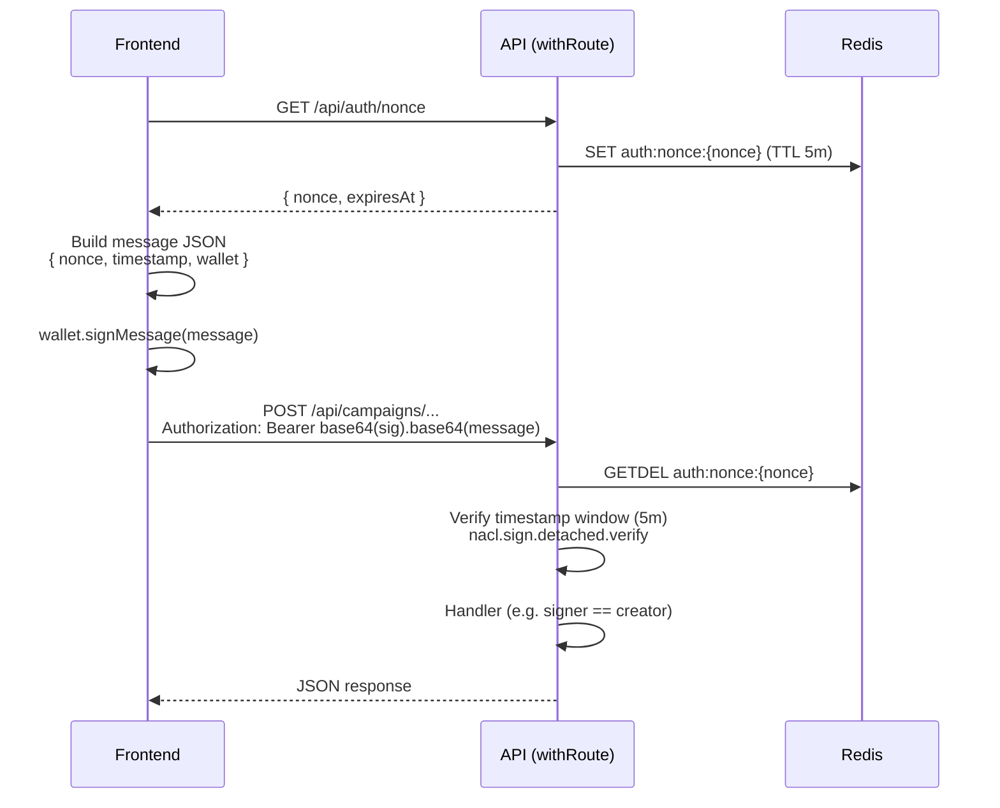

# API Route Trust Boundaries

**Spec:** `week8-docs` (US-1)  
**Audience:** Frontend and API implementers  
**Last updated:** 2026-06-10

This document lists every Next.js API route under `apps/web/src/app/api/`, its HTTP method(s), trust classification, and implementation notes. Classifications reflect **current code** in `withRoute()` and handler-level checks.

---

## Classification system

| Tier | Meaning | How it is enforced |
|------|---------|-------------------|
| **Public** | No authentication. Rate-limited per IP (default 60 req/min unless noted). Safe for anonymous reads and stateless helpers. | `withRoute()` without `auth: true` or `admin: true`; no secret header in handler. |
| **Wallet Auth** | Caller must prove control of a Solana wallet via ed25519 signature over a nonce-backed message. | `withRoute({ auth: true })` → `requireAuth()` in `@/lib/api/auth-middleware.ts`. Handlers often compare signer to on-chain authority (creator, cancel authority). |
| **Admin** | Internal/operator only. Not for browser clients. | `withRoute({ admin: true })` checks `x-admin-key` against `ADMIN_API_KEY`, or handler checks `Authorization: Bearer <CRON_SECRET>`. |
| **Removed** | Route still exists in the codebase but must not be used. State must come from the on-chain indexer. | Documented for migration; FE should not call this endpoint. |

### Why these tiers exist

- **Public reads** (campaign lists, proofs, timelines) mirror on-chain data that is already public on Solana. Rate limiting prevents abuse; wallet auth would block anonymous dashboard views.
- **Wallet Auth writes** build or record transactions that must match an on-chain signer (creator, cancel authority, beneficiary). Signature verification prevents spoofing another wallet's identity.
- **Admin** routes trigger bulk indexing or expose operator data (waitlist export). They use server secrets, not wallet signatures.
- **Removed** routes bypassed the indexer and allowed direct DB writes for `paused` / `cancelledAt`. That created a trust gap vs on-chain truth; status now flows from indexed events only.

---

## Route table

Routes are enumerated with:

```bash
find apps/web/src/app/api -name "route.ts" | sort
```

| Route | Method | Classification | Notes |
|-------|--------|----------------|-------|
| `/api/activity/[address]` | GET | Public | Activity feed for a wallet address. Read-only; rate limit 60/min. |
| `/api/admin/sync` | POST | Admin | Full event indexer run. Requires `x-admin-key: <ADMIN_API_KEY>`. Optional `fromSlot` in body. Rate limit 3/min. |
| `/api/auth/nonce` | GET | Public | Issues a one-time nonce (Redis, 5 min TTL). First step of wallet auth flow; not itself authenticated. |
| `/api/beneficiary/[address]/campaigns` | GET | Public | Lists campaigns where address is a beneficiary. Read-only. |
| `/api/beneficiary/[address]/vesting-progress` | GET | Public | Aggregated vesting progress for a beneficiary. Read-only. |
| `/api/campaigns` | GET | Public | Paginated campaign list. Read-only. |
| `/api/campaigns` | POST | Wallet Auth | Registers campaign + leaves after on-chain `create_campaign`. Signer must match `creator` in body; Merkle proofs verified. |
| `/api/campaigns/import` | POST | Wallet Auth | Parses CSV bulk recipient upload. `auth: true` enforced; used before prepare/create flow. |
| `/api/campaigns/prepare` | POST | Public | Builds Merkle tree, PDAs, and leaf payloads from recipients. Stateless computation; no wallet signature required (on-chain tx still signed client-side). |
| `/api/campaigns/[treeAddress]` | GET | Public | Single campaign detail by tree address. Read-only. |
| `/api/campaigns/[treeAddress]/cancel` | POST | Wallet Auth | Builds `cancel_campaign` transaction. Signer must match campaign cancel authority. |
| `/api/campaigns/[treeAddress]/cancel-stream` | POST | Wallet Auth | Builds per-stream cancel transaction. Signer must match cancel authority. |
| `/api/campaigns/[treeAddress]/claims` | GET | Public | Claim history for a campaign. Read-only. |
| `/api/campaigns/[treeAddress]/instant-refund` | POST | Wallet Auth | Builds instant-refund transaction. Signer must match cancel authority. |
| `/api/campaigns/[treeAddress]/milestones/[idx]` | POST | Wallet Auth | Builds milestone release transaction. Signer must match cancel authority. |
| `/api/campaigns/[treeAddress]/proof` | GET | Public | Merkle proof for a beneficiary leaf. Read-only. |
| `/api/campaigns/[treeAddress]/root-versions` | POST | Wallet Auth | Records a root version after on-chain `update_root`. Signer must match cancel authority. |
| `/api/campaigns/[treeAddress]/status` | PATCH | **Removed** | **Do not use.** Previously wrote `paused`, `cancelledAt`, etc. directly to DB. Status must come from indexer events (`CampaignPaused`, `CampaignUnpaused`, `CampaignCancelled`). |
| `/api/campaigns/[treeAddress]/timeline` | GET | Public | Event timeline for dashboard. Read-only. |
| `/api/campaigns/[treeAddress]/withdraw-unvested` | POST | Wallet Auth | Builds `withdraw_unvested` transaction after grace period. Signer must match cancel authority. |
| `/api/claims/sync` | POST | Admin | Indexes claim events for given transaction signatures. Requires `x-admin-key: <ADMIN_API_KEY>`. Rate limit 5/min. Trusted indexer / backend only — not for browser clients. |
| `/api/cron/sync` | GET | Admin | Vercel cron entry point for `indexAllEvents`. Requires `Authorization: Bearer <CRON_SECRET>`. Rate limit disabled. |
| `/api/events/sync` | POST | Public | Indexes Anchor events from given tx signatures (RPC fetch). Rate limit 20/min. No wallet or admin auth. |
| `/api/health` | GET | Public | Liveness: DB + RPC checks. Uses `errorHandler` only (no `withRoute` rate limit). Returns 503 when degraded. |
| `/api/schedule-templates` | GET | Public | Preset vesting schedule templates for campaign creation UI. |
| `/api/simulate-vesting` | POST | Public | Pure math simulation of vesting curve; no DB or chain writes. Rate limit 30/min. |
| `/api/waitlist` | POST | Public | Email signup for launch waitlist. Rate limit 5/min. |
| `/api/waitlist` | GET | Admin | Export waitlist (JSON or `?format=csv`). Requires `x-admin-key: <ADMIN_API_KEY>`. |

**Total:** 26 route files, **28** HTTP method entries (some paths expose multiple methods).

---

## Wallet auth flow (nonce → sign → verify)

Used by all **Wallet Auth** routes via `withRoute({ auth: true })`.



### Header format

```
Authorization: Bearer <base64url(signature)>.<base64url(messageBytes)>
```

`messageBytes` is UTF-8 JSON:

```json
{ "nonce": "...", "timestamp": 1718000000000, "wallet": "<base58 pubkey>" }
```

### Server checks (`requireAuth`)

1. Parse `Authorization` Bearer token into signature + message.
2. Consume nonce from Redis (`GETDEL`) — replay rejected if missing or reused.
3. Reject if `timestamp` is in the future or older than 5 minutes.
4. Verify ed25519 signature against `wallet` public key.
5. Route handler may additionally require signer to match creator or cancel authority.

### FE implementation checklist

- [ ] Fetch nonce before each mutating request (or refresh on 401).
- [ ] Include `Authorization` header on all Wallet Auth routes in the table above.
- [ ] Do not call `PATCH /api/campaigns/[treeAddress]/status`; poll indexed campaign state instead.
- [ ] Do not embed `ADMIN_API_KEY` or `CRON_SECRET` in client code.

---

## Admin auth

| Mechanism | Header | Env var | Routes |
|-----------|--------|---------|--------|
| Admin API key | `x-admin-key: <secret>` | `ADMIN_API_KEY` | `POST /api/admin/sync`, `POST /api/claims/sync`, `GET /api/waitlist` |
| Cron secret | `Authorization: Bearer <secret>` | `CRON_SECRET` | `GET /api/cron/sync` |

Both use timing-safe comparison (`verifyAdminKey` in `@/lib/auth.ts`).

---

## Migration notes

### Remove `PATCH /api/campaigns/[treeAddress]/status`

**Status:** Route still present but classified **Removed**.

**Problem:** Direct PATCH allowed the database to diverge from on-chain state (e.g. pause/cancel flags) without a corresponding transaction.

**Replacement:**

1. Creator/beneficiary actions go through wallet-signed transactions (`POST .../cancel`, `.../withdraw-unvested`, etc.).
2. Indexer ingests `CampaignPaused`, `CampaignUnpaused`, `CampaignCancelled`, and related events.
3. UI reads state from `GET /api/campaigns/[treeAddress]` and timeline endpoints.

**FE action:** Remove any client calls to `PATCH .../status`. If indexer lag is visible, use `POST /api/events/sync` or wait for cron sync — not manual status PATCH.

### `POST /api/claims/sync` — admin-only (resolved)

**Status:** Protected with `admin: true` in `withRoute()`.

Browser clients that need post-claim indexing should use `POST /api/events/sync` (public, rate-limited) or rely on cron/indexer — not embed `ADMIN_API_KEY`.

---

## Related documents

- Phase 00 partial policy: `docs/API_ROUTE_TRUST_BOUNDARIES.md` (four mutating routes only)
- Route wrapper: `apps/web/src/lib/api/route-wrapper.ts`
- Auth middleware: `apps/web/src/lib/api/auth-middleware.ts`
- Spec: `.claude/specs/week8-docs/requirements.md` (US-1)
