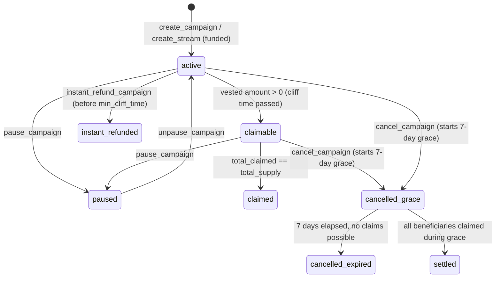

# Frontend Architecture — Velthoryn Token Vesting

> **Scope**: `apps/web/` — Next.js 15 App Router frontend for the Velthoryn Solana vesting protocol.
> **Last updated**: 2026-06-18 (Week 9)

---

## 1. Tech Stack

| Layer | Technology | Version |
|---|---|---|
| Framework | Next.js App Router | 15.5.18 |
| UI library | React | 19 |
| Server-state | TanStack Query | v5 |
| Component library | shadcn/ui | latest |
| Styling | Tailwind CSS | v4 |
| Solana wallet | `@solana/wallet-adapter-react` | latest |
| Anchor client | `@coral-xyz/anchor` | 0.32.1 |
| SPL tokens | `@solana/spl-token` | latest |
| `@solana/web3.js` | Solana web3.js | v1.98.4 (v1, not v2) |
| Testing (unit) | Vitest + Testing Library | latest |
| Testing (E2E) | Playwright | latest |
| DB ORM | Drizzle ORM | 0.39.3 |
| DB host | Supabase Postgres (pooler) | — |
| State (global) | Zustand | v5 |
| Notifications | sonner | latest |
| Fonts | Space Grotesk · JetBrains Mono · Geist | - |

> **Not implemented (Phase 2):** Supabase JS client (Auth + Storage), Pinata IPFS file uploads.

---

## 2. Directory Structure

```
apps/web/
├── src/
│   ├── app/                        # Next.js App Router
│   │   ├── (app)/                  # Authenticated shell layout
│   │   │   ├── layout.tsx          # AppShellLayout: Sidebar + Header + PendingCampaignIndexer
│   │   │   ├── campaigns/          # Campaign list (creator view)
│   │   │   ├── campaign/
│   │   │   │   ├── [id]/           # Campaign detail page
│   │   │   │   └── create/
│   │   │   │       ├── cliff/      # Cliff vesting create flow
│   │   │   │       ├── linear/     # Linear vesting create flow
│   │   │   │       └── milestone/  # Milestone vesting create flow
│   │   │   ├── dashboard/          # Beneficiary dashboard
│   │   │   ├── portfolio/          # Portfolio / holdings view
│   │   │   └── activity/           # Activity / timeline feed
│   │   ├── api/                    # Next.js Route Handlers
│   │   │   ├── campaigns/          # CRUD + detail endpoints
│   │   │   ├── beneficiary/        # Vesting progress endpoint
│   │   │   ├── claims/             # Claim sync endpoint
│   │   │   ├── events/             # On-chain event indexing
│   │   │   ├── prices/             # CoinGecko price proxy
│   │   │   └── cron/               # Auto-sync cron job
│   │   ├── landing/                # Public landing page
│   │   ├── layout.tsx              # Root layout (providers + fonts + CSP)
│   │   └── globals.css             # Tailwind v4 design tokens
│   ├── components/
│   │   ├── campaign/
│   │   │   ├── create/             # Create-flow form components
│   │   │   ├── detail/             # Campaign detail action buttons
│   │   │   └── list/               # CampaignRow, StatusBadge, RoleBadge
│   │   ├── dashboard/              # ActivityFeed, VestingProgressCard
│   │   ├── shell/                  # AppHeader, Sidebar
│   │   ├── providers/              # React context providers
│   │   └── ui/                     # shadcn/ui primitives
│   ├── hooks/                      # TanStack Query + Solana hooks
│   ├── lib/
│   │   ├── anchor/                 # client.ts, errors.ts, idl.ts
│   │   ├── api/                    # tx-builder.ts (server), client-auth.ts
│   │   ├── campaign/               # bulk.ts (CSV processing)
│   │   ├── merkle/                 # builder.ts (leaf encoding)
│   │   ├── sol/                    # cluster.ts, auto-wrap.ts
│   │   ├── stream/                 # persist.ts (local storage)
│   │   └── vesting/                # schedule.ts (vesting math)
│   └── types/                      # Shared TypeScript types
├── tests/
│   ├── e2e/                        # 23 Playwright chromium specs
│   │   └── signing/                # 10 real-wallet Playwright specs
│   ├── integration/                # 47 devnet integration tests
│   └── lib/                        # 572 Vitest unit tests (32 files)
└── next.config.ts                  # CSP headers, security headers
```

---

## 3. Provider Hierarchy

```
RootLayout
└── ThemeProvider (next-themes, dark/light)
    └── QueryProvider (TanStack Query v5)
        └── WalletProvider (@solana/wallet-adapter)
            └── WalletTokensProvider (token balances ctx)
                └── TooltipProvider (shadcn/ui)
                    └── AppShellLayout (app group)
                        ├── PendingCampaignIndexer (background indexing)
                        ├── Toaster (sonner notifications)
                        └── {page}
```

---

## 4. Data Flow

### Campaign Create Flow

```
Page (create/cliff|linear|milestone)
  → Form state (React state)
  → useCreateCampaign hook
      → buildWrapSolInstructions (if SOL)
      → derivePda (tree address)
      → initializeCampaign tx (Anchor)
      → depositTokens tx (Anchor)
      → savePendingCampaignIndexLocal (localStorage)
  ← PendingCampaignIndexer polls & calls /api/campaigns (POST)
  ← TanStack Query cache invalidated → campaign list refetches
```

### Claim Flow

```
Campaign detail page [id]
  → useProofLookup (GET /api/campaigns/[id]/proof?beneficiary=)
  → useClaimRecord (on-chain PDA fetch)
  → ClaimWithProofButton
      → buildClaimTx (tx-builder.ts, server action)
      → wallet.sendTransaction
      → /api/claims/sync (POST) → on-chain verify + DB write
  ← useCampaignDetail refetches (stale: 10s)
```

### Root Rotation

```
RootRotationCard
  → useUpdateRoot hook
      → updateRoot instruction (Anchor, new merkleRoot)
      → POST /api/campaigns/[id]/root-versions (CreateRootVersionRequest)
  ← useQuery invalidation on ["campaign", treeAddress]
```

---

## 5. State Management

| Layer | Tool | What it manages |
|---|---|---|
| Server state | TanStack Query v5 | Campaign data, proof data, vesting progress |
| Local state | React `useState` | Form fields, UI toggles, modal open/close |
| Global client state | Zustand (`useAppStore`) | `selectedCampaignId` — cross-component campaign selection |
| Persistent client | `localStorage` | Pending campaign index queue, sidebar collapse state |
| Wallet state | wallet-adapter context | Connected wallet, public key, sendTransaction |
| Token balances | WalletTokensProvider | SPL token accounts for connected wallet |

Query key conventions:
- `["campaign", treeAddress]` — single campaign detail
- `["vestingProgress", address]` — beneficiary portfolio
- `["proof", treeAddress, beneficiary]` — Merkle proof
- `["claimRecord", treeAddress, beneficiary]` — on-chain PDA
- `["campaigns"]` — campaign list

---

## 6. Wallet Integration

The app uses `@solana/wallet-adapter-react`. All Anchor program calls go through:

1. `useVestingProgram()` → returns `Program<Vesting>` (Anchor) or `null` if wallet not connected
2. `useConnection()` → returns `Connection` to `NEXT_PUBLIC_RPC_ENDPOINT`
3. `useWallet()` → returns `publicKey`, `sendTransaction`, `signTransaction`

**SOL auto-wrap**: When the selected token is native SOL (`So11111111111111111111111111111111111111112`), `buildWrapSolInstructions()` prepends `createAssociatedTokenAccount + transfer + syncNative` to the transaction before deposit.

**E2E mock wallet**: In Playwright tests, `localStorage.setItem('velthoryn:e2e-mock-send-tx', '1')` is set to bypass real signing. Requires `NEXT_PUBLIC_E2E_MOCK_WALLET=true` in `.env.test`.

---

## 7. FE–SC Communication

All on-chain interaction is server-side built then client-side signed:

```
Server (tx-builder.ts, Route Handler or Server Action)
  → Builds unsigned Transaction using Connection + Program IDL
  → Returns serialized base64 tx

Client (hook)
  → Deserializes tx
  → wallet.sendTransaction(tx, connection)
  → Waits for confirmTransaction
  → Calls /api/*/sync to record on-chain result in DB
```

**Key constants in tx-builder.ts:**
- `GRACE_PERIOD_SECS = 604800n` (7 days, mirrors on-chain constant)
- `PreparedTransaction` interface — returned by all builder functions

---

## 8. Campaign Lifecycle (8-State Model)

The `CampaignLifecycle` type (`active | paused | claimable | claimed | cancelled_grace | cancelled_expired | instant_refunded | settled`) is the central state machine for all UI branching.

```
          ┌─────────────────────────────────────────────────┐
          │                                                 ▼
  active ──┤─► paused ──► active                      instant_refunded
          │
          ├─► cancelled_grace ──► (7d) ──► cancelled_expired
          │
          ├─► settled (single-leaf cancel with vested split)
          │
          └─► claimed (all tokens claimed)
```

Helper `isGracePeriodVisible({ cancelledAt, instantRefunded, streamSettled })` → `true` only when **all three**: `cancelledAt !== null && !instantRefunded && !streamSettled`. The "less than 7 days" time check is separate — done by comparing `cancelledAt + GRACE_PERIOD_SECS` to `now`.

**UI branching by lifecycle state** (in `campaign/[id]/page.tsx`):
- `active`: vesting in progress, cliff not yet reached — show PauseToggleButton; claim button disabled with countdown
- `claimable`: at least some tokens vested — ClaimWithProofButton enabled, PauseToggleButton visible
- `claimed`: all tokens claimed — claim button disabled, show completion state
- `paused`: show resume button (PauseToggleButton), claim button disabled
- `cancelled_grace`: `isGracePeriodVisible() === true` — grace period countdown, ClaimWithProofButton still active for vested portion
- `cancelled_expired`: grace expired — claim disabled, show WithdrawUnvestedButton for creator
- `instant_refunded`: single-leaf instant refund — show refund banner, all actions disabled
- `settled`: single-leaf cancel with vested split — show settled state, no further claims

---

## 9. Dark Mode

Using `next-themes` with `ThemeProvider` at the root. Design tokens are in `globals.css` as CSS custom properties (`--background`, `--foreground`, `--primary`, etc.). shadcn/ui components consume these tokens. The default theme is dark.

---

## 10. Environment Variables

| Variable | Required | Description |
|---|---|---|
| `DATABASE_URL` | Yes | Drizzle ORM — Supabase Postgres connection string |
| `NEXT_PUBLIC_RPC_ENDPOINT` | Yes | Solana RPC URL (devnet or mainnet) |
| `ADMIN_API_KEY` | Yes | Admin-only route auth header |
| `API_KEY` | Yes | Internal API route auth |
| `CRON_SECRET` | Yes | Cron job auth (`/api/cron/sync`) |
| `COINGECKO_API_KEY` | Yes | CoinGecko price feed proxy (`/api/prices`) |
| `UPSTASH_REDIS_REST_URL` | Optional | Rate limiting (Upstash Redis) |
| `UPSTASH_REDIS_REST_TOKEN` | Optional | Rate limiting token |
| `ALLOWED_ORIGIN` | Optional | CORS origin (default: velthoryn.site) |
| `NEXT_PUBLIC_SENTRY_DSN` | Optional | Sentry error monitoring DSN |
| `NEXT_PUBLIC_ENABLE_VERCEL_ANALYTICS` | Optional | Enable Vercel Web Analytics |
| `NEXT_PUBLIC_SUPABASE_URL` | Phase 2 | Supabase project URL (client-side Auth/Storage — not yet active) |
| `NEXT_PUBLIC_SUPABASE_ANON_KEY` | Phase 2 | Supabase anon key (client-side Auth/Storage — not yet active) |
| `PINATA_JWT` | Phase 2 | Pinata IPFS JWT (file uploads — not yet implemented) |
| `PINATA_GATEWAY_URL` | Phase 2 | Pinata gateway URL (file uploads — not yet implemented) |
| `NEXT_PUBLIC_E2E_MOCK_WALLET` | Test only | Enable E2E mock wallet bypass (set in `dev:e2e` script) |
| `NEXT_PUBLIC_SOLANA_CLUSTER` | Optional | Override auto-detected cluster (`"devnet"` \| `"mainnet-beta"`) |

---

## 11. Known Product Tradeoffs

These are real tensions observed by external users and the core team. They are not bugs —
they are deliberate design choices with documented costs.

**1. 7-day grace period is hostile UX for legitimate cancellations.**
If an employee is on a two-week vacation when an admin cancels a campaign, they risk
losing already-vested tokens unless they happen to return within 7 days. Tokens that are
vested are contractually owed; the 7-day window introduces trust and legal risk.
*Why we kept it:* The grace period prevents a creator from cancelling and draining the
vault before a beneficiary can claim. It is a security guarantee, not just a convenience.
*Mitigation roadmap:* Make the grace period configurable per campaign (1 day → 30 days).
See [ADR-FE-007](ADRs/ADR-FE-007-cancel-instant-vs-grace-design.md) for cancel design context.

**2. Off-chain centralization: no backend → no claims.**
Merkle proof generation requires the off-chain tree to be available. If Velthoryn's
backend goes down, beneficiaries cannot claim — they cannot reconstruct the proof from the
Solana chain alone. This contradicts the "trustless" framing.
*Why we built it this way:* On-chain leaf storage at scale is prohibitively expensive.
Merkle compression trades decentralization for cost efficiency at 1000+ recipients.
*Mitigation:* Root rotation guard + eventual IPFS pinning of Merkle trees (Phase 2).

**3. Root rotation is operationally heavy.**
Revoking one recipient from a 1,000-person campaign requires recalculating the full
Merkle tree, generating a new root, updating it on-chain, and syncing the database so
all 999 remaining users can still generate valid proofs. Any desync leaves valid
recipients unable to claim.

**4. "Zero friction" claim is actually pull-based.**
Recipients must remember unlock schedules, return to the site, connect wallets, and
manually claim. True zero-friction would be push-based streams. The current design is
"low friction," not "zero friction."

> These tradeoffs were documented from real external user critique received during Week 6
> pilot testing. They inform the post-launch roadmap.

---

## 12. Security Headers

Set in `next.config.ts`:
- `Content-Security-Policy`: restricts scripts/frames, allows `wss://helius-rpc.com`
- `X-Frame-Options: DENY`
- `X-Content-Type-Options: nosniff`
- `Referrer-Policy: strict-origin-when-cross-origin`
- `Permissions-Policy: camera=(), microphone=(), geolocation=()`

---

## 13. Build & CI

| Command | Description |
|---|---|
| `pnpm --filter web dev` | Dev server (port 3000) |
| `pnpm --filter web build` | Production Next.js build |
| `pnpm --filter web lint` | Biome lint + TypeScript check |
| `cd apps/web && npx vitest --config vitest.unit.config.ts --run` | Unit tests (572 tests) |
| `cd apps/web && npx playwright test` | E2E chromium (23 specs) |
| `cd apps/web && npx playwright test --config playwright.signing.config.ts` | E2E signing (10 specs) |

CI pipelines: `.github/workflows/ci.yml` (unit + type), `.github/workflows/web-ci.yml` (build), `.github/workflows/lint.yml` (Biome).

---

## 14. Campaign Lifecycle State Diagram

The `CampaignLifecycle` type has 8 states. The diagram below shows valid transitions; all others are blocked by on-chain guards.



**FE helpers:**
- `isGracePeriodVisible(campaign)` → `true` when `cancelledAt != null && !instantRefunded && !streamSettled`
- `CampaignStatusBadge` renders a distinct badge variant for each of the 8 states.
- Source: `apps/web/src/lib/vesting/list.ts`

---

## 15. Root Rotation UI (useUpdateRoot + AllocationEditor)

`useUpdateRoot` hook (`src/hooks/useUpdateRoot.ts`) drives the Allocations page
(`src/app/(app)/campaign/[id]/allocations/page.tsx`).

**Flow:**
1. `AllocationEditor` rebuilds the Merkle tree client-side from the edited
   recipient list (via `src/lib/merkle/builder.ts`).
2. The hook calls `update_root(newRoot, newLeafCount, newMinCliffTime)` via
   `tx-builder.ts` (server action).
3. On success, posts the new leaves + proofs to
   `POST /api/campaigns/[id]/root-versions`.
4. TanStack Query key `["campaign", treeAddress]` is invalidated → campaign
   detail refetches with the new root.

**Constraints enforced by the program:**
- `SameRoot` (6004) — recomputed root equals the current on-chain root (no change).
- `NotCancellable` (6019) — `update_root` is signed by `cancel_authority`; only
  campaigns created with `cancellable: true` can rotate.
- Root rotation is all-or-nothing: the entire recipient set is replaced atomically.

**FE guard:** The `AllocationEditor` disables the "Save Allocations" button when
`computedRoot === campaign.merkleRoot` (pre-computes client-side to avoid a
wasted transaction).

---

## Further Reading

| Doc | What it covers |
|-----|---------------|
| [`FE_INTEGRATION_GUIDE.md`](FE_INTEGRATION_GUIDE.md) | Step-by-step: create campaign, claim tokens, admin ops — using hooks + tx-builder (code-first) |
| [`FE_HOOKS_REFERENCE.md`](FE_HOOKS_REFERENCE.md) | All 21 hooks + tx-builder functions: params, return types, TanStack Query keys, usage snippets |
| [`FE_COMPONENT_REFERENCE.md`](FE_COMPONENT_REFERENCE.md) | All 68 components with props and usage examples |
| [`FE_E2E_GUIDE.md`](FE_E2E_GUIDE.md) | Playwright E2E setup, mock wallet, writing new tests |
| [`ADRs/`](ADRs/) | FE-001 shadcn/ui, FE-002 mock wallet, FE-003 8-state lifecycle, FE-004 bankrun warpToSlot, FE-005 server-side tx building |
| [`INSTRUCTION_REFERENCE.md`](INSTRUCTION_REFERENCE.md) | On-chain instruction signatures (raw Anchor SDK level — Lana) |
