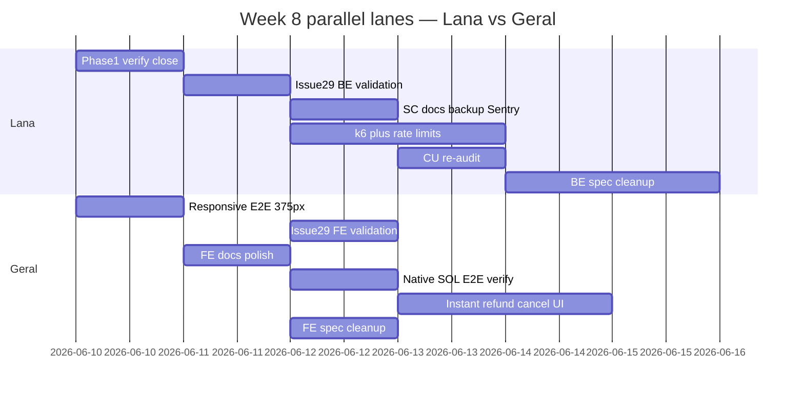
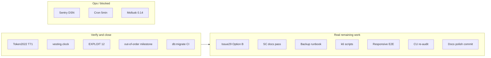

# Week 8 Remaining Gap Plan

**When:** Week 8 (Jun 2026) — finish gaps surfaced in the Week 8 report before week close.

Source: [weekly-report-mancer/week8/Lana.md](weekly-report-mancer/week8/Lana.md) · [docs/PENDING_WORK.md](docs/PENDING_WORK.md)

## Team split — Lana (BE/SC) vs Geral (FE)

Default ownership: **Lana = BE + SC + ops/infra**, **Geral = FE + E2E + FE docs**. Tasks are split across both where parallel work saves time.

### Lana (BE / SC / infra)

| Phase | Task | Skills |
|-------|------|--------|
| 1 | SC verification sweep (#4–7), CI migrate confirm (#13), update `PENDING_WORK.md` | `spec-verify`, `quality-assurance` |
| 2 | Issue #29 **BE**: `prepare/route.ts` + `import/route.ts` validation, `bulk-campaign.test.ts`, `SECURITY.md` | `spec-init`→`spec-tasks`→`spec-implement`, `supabase-database`, `solana-auditor` |
| 3a–b | SC docs pass (#10), backup runbook verify (#11) | `spec-verify`, `design-documentation`, `supabase-database` |
| 3c | Sentry DSN verify after Ops sets env (#12) | `troubleshooting` |
| 3d | BE docs: `BACKEND_API.md`, `API_TRUST_BOUNDARIES.md`, `TESTING.md` (SC/CI/k6 sections), root `README.md`, `docs/README.md` | `design-documentation` |
| 4a–b | k6 prepare/proof/spike scripts, rate limit tuning (#14–15) | `spec-implement`, `quality-assurance`, `code-reviewer` |
| 4e | CU re-audit + `CU_BUDGET.md` (#19) | `solana-builder`, `spec-verify` |
| 5 | Spec checkbox cleanup — **BE/SC specs** (`production-security-ops`, `bulk-send`, `sc-remediation`, `native-sol` BE tasks) | `spec-verify`, `spec-driven-development` |

### Geral (FE / E2E / FE docs)

| Phase | Task | Skills |
|-------|------|--------|
| 2 | Issue #29 **FE**: client-side validation in bulk-send / CSV import UI (same rule as BE); inline error copy | `spec-implement`, `qa` |
| 3d | FE docs: `FE_INTEGRATION.md`, `TRANSPARENCY_DASHBOARD.md` | `design-documentation` |
| 4c | Clawback responsive E2E — 4 tests at 375px (#17) | `spec-implement`, `qa` |
| 4d | Native SOL E2E verify (#18), `wrap-sol.spec.ts`, T22 devnet checklist in `TESTING.md` | `spec-verify`, `qa` |
| — | **Blocked (Geral backlog):** native SOL create flows (`*_native`), instant-refund cancel UI | `spec-implement` |
| 5 | Spec checkbox cleanup — **FE specs** (`dashboard-transparency`, `automatic-clawback-ui`, `vesting-ux-hardening` FE tasks) | `spec-verify` |

### Shared / handoff points

| Handoff | Who leads | What to agree on |
|---------|-----------|------------------|
| Issue #29 error contract | **Lana first** (0.5 day) | Exact `ValidationError` message + which `releaseType` values count as cliff/linear — Geral mirrors in FE before merge |
| Docs polish PR | **Split PRs** | Lana PR: BE/SC docs; Geral PR: FE docs — avoids merge conflicts on `TESTING.md` (Lana owns SC/k6 section, Geral owns E2E section) |
| `PENDING_WORK.md` close | **Lana** | Geral pings when FE tasks (#17, #18, Issue #29 FE) land so Lana can mark done |
| Sentry (#12) | **Ops → Lana** | Geral optionally smoke-tests client errors in browser after DSN is live |

### Parallel tracks (finish faster)

**Day 1 (parallel):** Lana runs Phase 1 verification; Geral starts responsive E2E (#17) — no dependency.

**Day 2:** Lana ships Issue #29 BE + publishes error message; Geral wires FE validation + starts FE docs.

**Day 3–4 (parallel):** Lana k6 + rate limits; Geral native SOL E2E + instant-refund UI.

**Day 5+:** Lana CU re-audit + spec cleanup; Geral FE spec cleanup.

---

## Gap audit refresh (do first — Lana)

A code re-check shows **5 of 11 “real gaps” are already implemented** — they only need verification and checklist closure:

| # | Task | Evidence | Action |
|---|------|----------|--------|
| 4 | Token-2022 mint guard | `create_campaign.rs` / `create_stream.rs` constraint + `T71` in `vesting.supplementary.spec.ts` | Run test, mark done |
| 5 | Clock pause→cancel→claim | `tests/vesting.clock.spec.ts` line ~1385 | Run test, mark done |
| 6 | EXPLOIT 12 label | `tests/security.spec.ts` line ~844 | Run test, mark done |
| 7 | Out-of-order milestone E2E | `vesting.supplementary.spec.ts` line ~522 (`0→2→1`) | Run test, mark done |
| 13 | CI migration strategy | `.github/workflows/lint.yml` + `web-ci.yml` use `pnpm db:migrate` | Fix stale `BACKEND_API.md` “push” wording, mark done |

---

## Phase 1 — Verification sweep (0.5 day) — **Lana**

**Goal:** Close false-positive gaps; refresh [docs/PENDING_WORK.md](docs/PENDING_WORK.md) counts.

**Tasks:**
1. Run targeted SC tests:
   - `anchor test --skip-deploy tests/vesting.clock.spec.ts` (pause→cancel→claim case)
   - `anchor test --skip-deploy tests/security.spec.ts` (EXPLOIT 12)
   - `anchor test --skip-deploy tests/vesting.supplementary.spec.ts` (T71 Token-2022, out-of-order milestone)
2. Confirm CI uses migrate: [`.github/workflows/lint.yml`](.github/workflows/lint.yml), [`.github/workflows/web-ci.yml`](.github/workflows/web-ci.yml)
3. Update `PENDING_WORK.md` — move items 4–7, 13 to “Recently completed”; fix summary table (11 → ~6 real gaps)

**Skills:**
- [`spec-verify`](.claude/skills/spec-verify/SKILL.md) — confirm spec claims match code
- [`quality-assurance`](~/.cursor/plugins/cache/kiro-marketplace/kiro-spec-driven/.../skills/quality-assurance/SKILL.md) — test matrix and acceptance gates

---

## Phase 2 — Known Issue #29 Option B (1–2 days) — **Lana + Geral**

**Decision:** Option B per [docs/KNOWN_ISSUE_29_DESIGN.md](docs/KNOWN_ISSUE_29_DESIGN.md) — **no breaking SC change**; enforce “one cliff/linear leaf per beneficiary” at prepare time.

### Lana (BE) — ship first

1. **BE validation** in [`prepare/route.ts`](apps/web/src/app/api/campaigns/prepare/route.ts) and [`import/route.ts`](apps/web/src/app/api/campaigns/import/route.ts):
   - Mirror existing milestone duplicate check (lines 36–64)
   - Reject when a beneficiary has >1 non-milestone leaf (`releaseType` cliff/linear)
   - Publish agreed `ValidationError` message (cite Known Issue #29)
2. **API tests:** [`tests/api/bulk-campaign.test.ts`](apps/web/tests/api/bulk-campaign.test.ts) — reject multi cliff/linear per wallet
3. **Docs:** `KNOWN_ISSUE_29_DESIGN.md` §6 enforcement note + [`SECURITY.md`](docs/SECURITY.md)
4. **Optional:** SC regression documenting on-chain `NothingToClaim` for two-leaf same-beneficiary

**Skills (Lana):** `spec-init`→`spec-tasks`→`spec-implement`, `supabase-database`, `solana-auditor`, `spec-verify`

### Geral (FE) — start after Lana publishes error contract (can stub message Day 1)

1. **FE validation** in bulk-send / CSV import UI — same rule, block submit before API call
2. **UX:** Surface validation error inline (match BE message)
3. **Optional:** component test for duplicate-beneficiary cliff/linear row

**Skills (Geral):** `spec-implement`, `qa`

---

## Phase 3 — Docs & ops verification (1 day) — **split**

### 3a — SC docs final pass (#10) — **Lana**

Verify these match current program state (post-`4a3e7a0`):
- [`docs/SECURITY.md`](docs/SECURITY.md)
- [`docs/PDD_LANA.md`](docs/PDD_LANA.md)
- [`docs/TDD_LANA.md`](docs/TDD_LANA.md)
- [`docs/AUDIT_REPORT.md`](docs/AUDIT_REPORT.md)
- [`docs/MATURITY_REPORT.md`](docs/MATURITY_REPORT.md)

Cross-check: CU budget, Token-2022 guard, pause→cancel semantics, Known Issue #29 status.

**Skills:** [`spec-verify`](.claude/skills/spec-verify/SKILL.md), [`design-documentation`](~/.cursor/plugins/cache/kiro-marketplace/kiro-spec-driven/.../skills/design-documentation/SKILL.md)

### 3b — Backup runbook verification (#11) — **Lana**

Walk through [`docs/operations/backup-restore.md`](docs/operations/backup-restore.md):
- PITR steps, `pg_dump` commands, restore verification (§4), weekly drill checklist
- Add any missing env vars or Supabase dashboard paths found during dry-run

**Skills:** [`quality-assurance`](quality-assurance), [`supabase-database`](supabase-database)

### 3c — Sentry DSN (#12, Ops) — **Lana verify, Geral optional smoke**

Scaffolding exists: [`apps/web/sentry.client.config.ts`](apps/web/sentry.client.config.ts), [`sentry.server.config.ts`](apps/web/sentry.server.config.ts), [`.env.example`](apps/web/.env.example).

**Action:** Ops sets `NEXT_PUBLIC_SENTRY_DSN` in Vercel; **Lana** verifies server 500 appears in Sentry; **Geral** optionally confirms client-side capture in browser.

**Skills (Lana):** `troubleshooting` · **Skills (Geral):** `qa`

### 3d — Docs polish commit (uncommitted) — **split PRs**

**Lana PR:**
- [`README.md`](README.md), [`docs/README.md`](docs/README.md)
- [`docs/BACKEND_API.md`](docs/BACKEND_API.md) — auth tiers, `db:migrate` not `push`
- [`docs/API_ROUTE_TRUST_BOUNDARIES.md`](docs/API_ROUTE_TRUST_BOUNDARIES.md) — superseded by [`API_TRUST_BOUNDARIES.md`](docs/API_TRUST_BOUNDARIES.md)
- [`docs/TESTING.md`](docs/TESTING.md) — SC, CI, k6 sections only

**Geral PR:**
- [`docs/FE_INTEGRATION.md`](docs/FE_INTEGRATION.md) — `events/sync` vs `claims/sync` admin boundary
- [`docs/TRANSPARENCY_DASHBOARD.md`](docs/TRANSPARENCY_DASHBOARD.md)
- [`docs/TESTING.md`](docs/TESTING.md) — E2E / Playwright sections only

**Skills:** `design-documentation`, `caveman-commit`, `split-to-prs`

---

## Phase 4 — Production polish (2–3 days) — **split**

### 4a — k6 load test expansion (#14) — **Lana**

Current: [`apps/web/tests/load/api-load.js`](apps/web/tests/load/api-load.js) — health, campaigns list, simulate-vesting only.

**Add scripts:**
| Script | Target | RPS goal |
|--------|--------|----------|
| `prepare-load.js` | `POST /api/campaigns/prepare` | 10 RPS |
| `proof-load.js` | `GET /api/campaigns/:addr/proof/:beneficiary` | 50 RPS |
| `spike-load.js` | Mixed burst (health + campaigns + prepare) | spike to 200 VUs |

Wire into [`run-load-test.sh`](apps/web/tests/load/run-load-test.sh) if present; document baseline p95 in `docs/TESTING.md`.

**Skills:** [`spec-implement`](spec-implement), [`quality-assurance`](quality-assurance), [`research`](research) — k6 threshold tuning

### 4b — Rate limit tuning (#15, after 4a) — **Lana**

Tune limits in [`apps/web/src/lib/api/rate-limit.ts`](apps/web/src/lib/api/rate-limit.ts) + per-route config in [`route-wrapper.ts`](apps/web/src/lib/api/route-wrapper.ts) based on k6 p95 / 429 rates.

**Skills:** [`quality-assurance`](quality-assurance), [`code-reviewer`](subagent) — avoid over-tightening public reads

### 4c — Clawback responsive E2E (#17) — **Geral** (can start Day 1, parallel to Lana Phase 1)

Functional clawback E2E is **done** (33 tests in [`campaign-actions.spec.ts`](apps/web/tests/e2e/campaign-actions.spec.ts)). Missing: **4 responsive cases** from [`docs/AUTOMATIC_CLAWBACK.md`](docs/AUTOMATIC_CLAWBACK.md) §Responsive Verification:

1. Grace banner at 375px viewport
2. Needs Action tab wrap on narrow viewport
3. Sidebar amber dot visible on mobile (drawer open)
4. Dashboard Needs Attention stacks on mobile

Add `test.use({ viewport: { width: 375, height: 812 } })` describe block; reuse existing mocks from clawback section (lines ~491–787).

**Skills:** [`spec-implement`](spec-implement), [`qa`](subagent) — Playwright viewport patterns

### 4d — Native SOL + instant refund (#18 + Geral backlog) — **Geral**

`TokenPickerModal` exists ([`TokenPickerModal.tsx`](apps/web/src/components/campaign/create/TokenPickerModal.tsx)); T19/T20 native paths done per report.

**Action:**
1. Verify T21 / `wrap-sol.spec.ts`; document T22 manual devnet checklist in `TESTING.md` (E2E section)
2. Wire native SOL create flows (`*_native` when mint = `NATIVE_SOL_MINT`)
3. Instant-refund cancel UI (`instantRefundEligible` + distinguish instant vs grace)

**Skills:** `spec-implement`, `spec-verify`, `qa`

### 4e — CU budget re-audit (#19) — **Lana**

Re-run benchmarks in [`tests/benchmarks.rs`](tests/benchmarks.rs) against mainnet-fee parameters; update [`docs/CU_BUDGET.md`](docs/CU_BUDGET.md) with final `compute_budget` recommendations for client SDK.

**Skills:** [`solana-builder`](subagent), [`spec-verify`](spec-verify)

---

## Phase 5 — Spec checkbox cleanup (batch, low priority) — **split**

**62 items** in `PENDING_WORK.md` §“Already done but not checked in specs” — code exists, spec `tasks.md` checkboxes stale.

| Owner | Spec folders |
|-------|--------------|
| **Lana** | `production-security-ops`, `bulk-send`, `sc-remediation`, `native-sol-vesting` (BE tasks) |
| **Geral** | `dashboard-transparency`, `automatic-clawback-ui`, `vesting-ux-hardening` (FE tasks) |

**Approach:** Each owner runs `spec-verify` on their folders, marks `[x]` in `.claude/specs/*/tasks.md`.

**Skills:** `spec-verify`, `spec-driven-development`

---

## Blocked / out of scope (track only)

| Item | Owner | Blocker |
|------|-------|---------|
| Mollusk 0.14+ (#20) | Lana | Upstream |
| SPL handler tests (#21) | Lana | Mollusk 0.14 |
| Cron 5-min sync (#22) | Ops | Vercel paid plan |
| External audit (#23) | Ops | Budget |
| Monitoring dashboard (#24) | Ops | Infra |
| Mainnet deploy (#25) | Ops | Post-audit |
| Multisig execution (#26) | Ops | Runbook exists |
| Native SOL create UI (#18 partial) | Geral | FE `*_native` instruction wiring |
| Instant refund cancel UI | Geral | `instantRefundEligible` UX |

---

## Suggested execution order

**Lana:** Phase 1 → Issue #29 BE → k6 + rate limits (parallel with Geral E2E) → SC docs + backup + Sentry → CU re-audit → BE docs PR → BE spec cleanup

**Geral:** Responsive E2E (Day 1) → Issue #29 FE (after Lana error contract) → FE docs PR → Native SOL E2E → instant-refund UI → FE spec cleanup

**Merge order:** Lana Issue #29 BE PR first → Geral Issue #29 FE PR → either docs PR → polish PRs in parallel.

---

## Skills reference (by category)

| Category | Skills to use |
|----------|---------------|
| Spec workflow | `spec-init`, `spec-design`, `spec-tasks`, `spec-implement`, `spec-verify` |
| Solana / SC | `solana-auditor`, `solana-builder` (subagents) |
| Backend / DB | `supabase-database`, `quality-assurance` |
| Frontend / E2E | `qa` (subagent), `spec-implement` |
| Docs | `design-documentation`, `spec-verify` |
| Security review | `security-review` (subagent) — after Issue #29 BE validation |
| Git / PR | `caveman-commit`, `babysit`, `split-to-prs` — when shipping |

---

## Success criteria

- `PENDING_WORK.md` shows **0 open high-priority code gaps** (items 4–13 closed or verified)
- Prepare/import **rejects** multi cliff/linear leaves per beneficiary with tested error
- k6 scripts exist for prepare + proof + spike with documented baselines
- 4 responsive Playwright tests pass at 375px
- Uncommitted docs committed; `BACKEND_API.md` reflects `db:migrate`
- Sentry DSN live in staging/production (Ops)
- Optional: 62 spec checkboxes updated in batch PR
